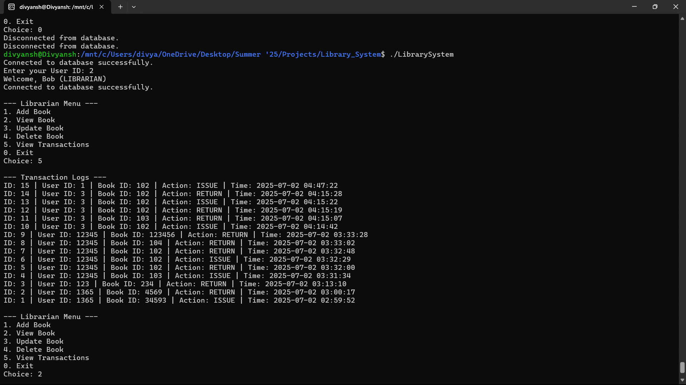

# 📚 Library Management System (C++ + MySQL)

A fully functional **Library Management System** implemented in **C++** using **Object-Oriented Programming (OOP)** principles and integrated with a **MySQL database** for persistent storage and transaction logging.

---

## 🚀 Features

### 🧑‍🎓 Student
- View book information
- Issue books
- Return books
- Automatically logged in via `User ID`

### 🧑‍💼 Librarian
- Add new books
- Update existing book details
- Delete books (only if present)
- View transaction logs (ISSUE / RETURN)
- Role-based login from database

### 🧠 System Architecture
- Uses **OOP concepts**: Inheritance, Polymorphism, Encapsulation
- Connects to **MySQL** using **MySQL Connector/C++**
- Menu-driven Command Line Interface (CLI)
- Logs transactions with timestamps

---

## 🏗️ Project Structure

    Library_System/
    │
    ├── include/ # Header files for all classes
    │ ├── Book.h
    │ ├── User.h
    │ ├── Student.h
    │ ├── Librarian.h
    | ├── Transaction.h
    │ └── DBConnector.h
    │ 
    ├── src/ # Source files
    │ ├── main.cpp
    │ ├── Book.cpp
    │ ├── User.cpp
    │ ├── Student.cpp
    │ ├── Librarian.cpp
    | ├── Transaction.cpp
    │ └── DBConnector.cpp
    │
    ├── sql/
    │ └── schema.sql # DB schema (Users, Books, Transactions)
    │
    ├── Makefile # Optional: For building project
    └── README.md # Project info


---

## 🛠️ Setup Instructions

### ✅ 1. Install Dependencies
- MySQL Server
- MySQL Connector/C++ (download and extract: [MySQL Connector/C++](https://dev.mysql.com/downloads/connector/cpp/))
- C++ Compiler (g++, MinGW or Linux)

### ✅ 2. Create MySQL Database

```bash
mysql -u root -p       # Need to provide password for sql
CREATE DATABASE librarydb;
USE librarydb;
SOURCE sql/schema.sql;
```

### ✅ 3. Build the Project
`g++ -Iinclude src/*.cpp -lmysqlcppconn -o LibrarySystem`

### ✅ 4. Run the Program
`./LibrarySystem`


---

## 🗃️ Sample Data

```bash
INSERT INTO Users (id, name, email, role) VALUES
(1, 'Alice', 'alice@iitb.ac.in', 'STUDENT'),
(2, 'Bob', 'bob@iitb.ac.in', 'LIBRARIAN');

INSERT INTO Books (id, title, author, isAvailable) VALUES
(101, 'C++ Primer', 'Lippman', TRUE),
(102, 'Clean Code', 'Robert C. Martin', TRUE);
```

---

## 🧱 Class Diagram (Object-Oriented Design)
### 📄 UML-style Class Diagram (Text)

                       +----------------+
                       |     User       |  <abstract>
                       +----------------+
                       | - id           |
                       | - name         |
                       | - email        |
                       +----------------+
                       | +getDetails()  |  <-- virtual
                       +----------------+
                             ▲
                +------------+------------+
                |                         |
        +----------------+       +------------------+
        |   Student       |       |   Librarian      |
        +----------------+       +------------------+
        | - rollNumber    |       | - employeeId     |
        +----------------+       +------------------+
        | +getDetails()   |       | +getDetails()    |
        | +showMenu()     |       | +showMenu()      |
        +----------------+       +------------------+

           +-------------+
           |    Book     |
           +-------------+
           | - bookId    |
           | - title     |
           | - author    |
           | - isAvail   |
           +-------------+
           | +displayInfo() |
           | +markIssued()  |
           | +markReturned() |
           +-------------+

           +-------------------+
           |   DBConnector     |
           +-------------------+
           | - driver          |
           | - con             |
           +-------------------+
           | +connect()        |
           | +disconnect()     |
           | +insertBook()     |
           | +updateBook()     |
           | +deleteBook()     |
           | +getBook()        |
           | +getUserById()    |
           +-------------------+


---

## 📊 ER Diagram (Database Design)

    +-----------+         +-----------+          +----------------+
    |   Users   |         |  Books    |          |  Transactions  |
    +-----------+         +-----------+          +----------------+
    | id (PK)   |         | id (PK)   |          | id (PK)        |
    | name      |         | title     |          | user_id (FK)   |
    | email     |         | author    |          | book_id (FK)   |
    | role      |         | isAvailable |        | action         |
    +-----------+         +-----------+          | timestamp      |
                                                 +----------------+

### Relationships:
 - Users ↔ Transactions: One-to-Many (user_id)
 - Books ↔ Transactions: One-to-Many (book_id)


---




---

### 👨‍💻 Author
- Divyansh Agrawal
- IIT Bombay
- Library Management System — Summer Project 2025

## 📌 License   
Copyright (c) 2025 Divyansh Agrawal
